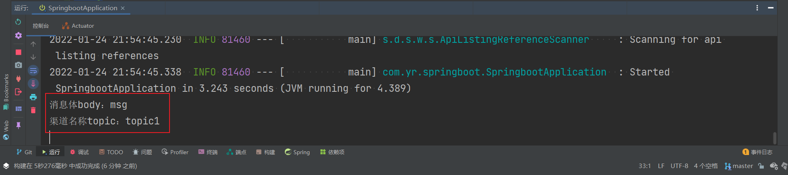

# Springboot 学习笔记

---

## 2 AOP 开发

### 2.1 demo01：一个约定编程示例

1. **interceptor / Myinterceptor：**自定义一个拦截器，拦截器中提供织入流程的方法。

```java
/**
 * @description: interceptor 自定义拦截器的实现类。
 * 拦截器中方法的执行流程，在代理对象 ProxyBean 的 invoke 方法中被定义
 */
public class MyInterceptor implements Interceptor {

  /**
   * 调用方法时，会先执行拦截器中的 before 方法。
   */
  @Override
  public boolean before() {
    System.out.println("事前方法，before...");
    return true;
  }

  /**
   * 方法调用执行完成后，会执行拦截器中的 after 方法。
   */
  @Override
  public void after() {
    System.out.println("事后方法，after...");
  }

  @Override
  public Object around(Invocation invocation) throws InvocationTargetException, IllegalAccessException {
    System.out.println("around before....");

    // proceed 方法，可回调 target对象 对应的方法。
    Object object = invocation.proceed();
    System.out.println("around after....");
    return object;
  }

  /**
   * 在 after 方法执行完后，若执行 around 方法或者回调 target 方法时，未发生异常，则执行该方法。
   */
  @Override
  public void afterReturning() {
    System.out.println("afterReturning...");
  }

  /**
   * 在 after 方法执行完后，若执行 around 方法或者回调 target 方法时，发生异常，则执行该方法。
   */
  @Override
  public void afterThrowing() {
    System.out.println("afterThrowing....");
  }

  /**
   * 若 useAround 方法返回 true，则方法在调用时，会执行拦截器的 around 方法。若返回 false，则执行原方法。
   */
  @Override
  public boolean userAround() {
    return true;
  }
}

```


2. **ProxyBean：**代理对象，在代理对象中的 **invoke** 方法定义约定的流程，流程中的方法来自拦截器。

```java
/**
 * @description: 代理对象，对真实对象进行代理，以便于将服务类和拦截方法织入对应的流程。
 */
public class ProxyBean implements InvocationHandler {
  private Object target;
  private Interceptor interceptor = null;

  /**
   * 绑定 代理对象
   * @param target —— 被代理的对象
   * @param interceptor —— interceptor 拦截器
   * @return 代理对象
   */
  public static Object getProxyBean(Object target, Interceptor interceptor){
    ProxyBean proxyBean=new ProxyBean();

    //保存被代理的对象
    proxyBean.target=target;

    //保存拦截器
    proxyBean.interceptor=interceptor;

    //生成代理对象
    Object proxy= Proxy.newProxyInstance(target.getClass().getClassLoader(), target.getClass().getInterfaces(), proxyBean);

    return proxy;
  }

  /**
   * 处理代理对象 的方法逻辑
   * @param proxy —— 代理对象
   * @param method —— 当前方法
   * @param args —— 运行参数
   * @return 方法调用结果
   * @throws Throwable 异常
   */
  @Override
  public Object invoke(Object proxy, Method method, Object[] args) throws Throwable {
    //异常标识
    boolean exceptionFlag = false;

    Invocation invocation = new Invocation(target,method,args);

    Object object = null;

    // 执行拦截器中的 before 方法
    this.interceptor.before();

    try {
      // 如果 userAround 方法返回 true，则执行拦截器中的 around 方法，否则，执行 target对象 对应的方法。
      if (this.interceptor.userAround()) {
        object = this.interceptor.around(invocation);
      }
      else {
        object = method.invoke(target,args);
      }
    }
    catch (Exception e) {
      exceptionFlag = true;
    }

    // 执行拦截器中的 after 方法。
    this.interceptor.after();

    // 针对是否产生异常，执行拦截器中对应的方法。
    if (exceptionFlag) {
      this.interceptor.afterThrowing();
    }
    else {
      this.interceptor.afterReturning();
      return object;
    }
    return null;
  }
}

```

```java
/**
 * @description: 拦截器 interceptor 中，around 方法中，invocation 对象的源码。
 */
@Data
public class Invocation {
  private Object[] param;
  private Method method;
  private Object target;

  public Invocation(Object target,Method method,Object[] param){
    this.method=method;
    this.target=target;
    this.param=param;
  }

  /**
   * 反射方法。以反射的形式去调用原有的方法。
   */
  public Object proceed() throws InvocationTargetException,IllegalAccessException {
    System.out.println("调用 target 对象对应的方法。target：" + target + "method："+method);
    return method.invoke(target,param);
  }
}

```


3. **测试用例 t1：**约定编程的测试用例。

```java
public void t1(){
    HelloService helloService = new HelloServiceImpl();

    // 获取代理对象，实现约定的流程。
    HelloService proxy= (HelloService) ProxyBean.getProxyBean(helloService, new MyInterceptor());

    // target 对象为 HelloServiceImpl，调用的方法为 sayHello。
    // 正常返回，afterReturning
    proxy.sayHello("zhangsan");

    System.out.println("**********name is null************");
    // 异常返回，afterThrowing
    proxy.sayHello(null);
}
```

---


### 2.2 AOP 编程的一个实例

==所有的切面，都必须在 Springboot 的启动类中，利用 @Bean 注解进行注入。==

```java
/**
 * 定义切面
 */
@Bean(name = "MyAspect01")
public MyAspect02 initMyAspect01 () {
    return new MyAspect01();
}

```


#### 2.2.1 demo02：AOP编程，非环绕通知

1. **aspect / MyAspect01：**利用 @Aspect 注解定义一个切面。切面中未加入around环绕通知。切面流程为：
   1. 先执行 Before
   2. 再执行 After
   3. 未出现异常执行 AfterReturning，出现异常执行 AfterThrowing
2. **pointCut：**利用 @Pointcut() 注解定义切点，切点的作用在于标明什么方法在执行时才会启用 AOP。execution()里的正则表达式注明了要拦截的方法。
3. 基于 AOP 的编程，相对于上述的约定编程示例，可知，Springboot中的 AOP自动约定了流程，自动实现了代理。用户只需要创建一个切面，定义切点，即可实现面向 AOP 的编程。
3. 在 Springboot 的启动类中，加入定义切面 MyAspect01 的代码。
3. **测试用例：**userController，调用API后（API集成在swagger中，浏览器输入：localhost:8888/swagger-ui.html），控制台打印引入 AOP 后的运行结果。

---


#### 2.2.2 demo02：AOP 编程，引入环绕通知

环绕通知是所有通知中最强大的通知，强大也意味着难以控制。一般而言，使用环绕通知的场景是需要大幅度修改原有目标对象的服务逻辑时，否则尽量使用其他通知。同时，由于底层 Spring 版本之间的差异留下的问题，会使得在使用环绕通知时，Before() 的执行会受到影响，因此，在非必要时，不要使用环绕通知。

而在更高版本的 Springboot 2.4.1 中，引入环绕通知后，测试结果则更加混乱，因此，环绕通知在实际的开发中，不得使用。

环绕通知是一个取代原有目标对象方法的通知，当然，他也提供回调原有目标对象方法的能力。

1. **MyAspect02：**利用 @Aspect 注解定义一个切面。切面中加入around环绕通知。其余与 MyAspect01并无差别。切面流程为：
   1. 先执行 Before
   2. 执行 Around
   3. 再执行 After
   4. 未出现异常执行 AfterReturning，出现异常执行 AfterThrowing
2. **测试用例t2：**引入环绕通知后，进行的测试。注意，此时 MyAspect01 中的 @Aspect 注解需要取消。

> **注意：**
>
> 在引入环绕通知中，设计中的输出结果是：
>
> ```apl
> before....
> around before....
> id = 2222
> username  = zhangsan
> 使用环绕通知
> around after....
> after....
> afterReturning....
> ```
>
> 
>
> 而在实际测试中，Springboot 版本为 2.1.6。出现的结果是如下。先打印出了 **around before…**
>
> 在测试中，引入环绕通知后，环绕通知将被率先执行，且：
>
> 1. 环绕通知中未回调原有目标对象的方法，before() 将不会被执行。执行完 around() 后，后续正常。
> 2. 环绕通知中回调原有目标对象的方法，先执行 around() 中回调之前的代码，在执行回调的过程中会按照切面的流程执行，先执行 Before，再实行回调的方法以及 around() 中回调之后的代码，后续正常。
> 2. 而在更高的版本 Springboot 2.4.1 中，引入环绕通知后，运行的结果更加混乱。
>
> ```apl
> around before....
> before....
> id = 2222
> username  = zhangsan
> 使用环绕通知
> around after....
> after....
> afterReturning....
> ```
>
> 

---


#### 2.2.3 demo02：功能增强 + 通知获取参数

对应切面为 **MyAspect03**，该切面必须在 Springboot 的启动类中，以Bean注解的形式加入，否则将出错。

**测试用例：t3**

##### 1. 功能增强

1. 对原本的 UserService 功能进行增强，为此，在 service 中添加一个用户检测接口 UserValidator 及其实现类。在切面中加入该用户检测接口。

2. **@DeclareParents：**引入新的类来增强服务，有两个必须配置的属性：

   * value：指向你要增强功能的目标对象，这里是增强 UserServiceImpl 对象，则 value 的值为 com.yr.springboot.demo02.service.User02ServiceImpl。
   * defaultImpl：引入增强功能的类，该类只能是非抽象类。“+”号表示这个类的子类。

   ==注意== UserServiceImpl后面不添加 “+” 号，在Springboot2 之后，“+”加号表示这个类的子类，不包括其本身。

##### 2. 通知获取参数

1. 在非环绕接口中：
   - 在注解中添加：args(user)，表明传入的参数名称为 user。
   - 在方法中利用 JoinPoint 传入对应的参数。方法传参中的 User user 不可省略，且与注解中的参数名称保持一致。
2. 在环绕接口中：
   - 在注解中添加：args(user)，表明传入的参数名称为 user。
   - 在方法中利用 ProceedingJoinPoint 传入对应的参数。方法传参中的 User user 不可省略，且与注解中的参数名称保持一致。

---


#### 2.2.4 demo02：织入

织入是一个生成动态代理对象并且将切面和目标对象方法编织成为约定流程的过程。对于流程上的通知，前文已经有了比较完善的说明。而对于动态代理的实现，也有多种方法。

Spring采用了 JDK 和 CGLIB 两种方式实现动态代理。前文的 接口+实现类 的方式正是 JDK 的方式。而 CGLIB 的方式则不需要实现接口，直接在 service 类中添加 @Service 注解即可。

1. **aspect / MyAspect04：**对 CGLIB 方式进行测试。
2. **service / TestService：**service 类添加 @Service 注解。
3. **测试用例：t4**

---


### 2.3 多个切面

Springboot 支持多个切面的同时运行。并提供确定切面运行顺序的两种方式：@Order注解 和 Ordered接口。

1. **manyAspect：**创建多个切面，每一个切面的切入点是一样的。
2. 利用 @Order() 注解限定切面的执行顺序。切面执行的顺序即 @Order 注解中的数字(int型) 从小到大排列的顺序。
3. **service / TestService / test( )：**切入点。
4. **测试用例：t5**

测试结果如下。对于前置通知(before)，都是从小到大运行的，对于后置通知(after)，则是从大到小运行。其实质，是多个切面之间的层层嵌套，这是一个典型的责任链模式的顺序。

```
Aspect01 before...
Aspect02 before...
Aspect03 before...
多个切面测试...
Aspect03 after...
Aspect03 afterReturning...
Aspect02 after...
Aspect02 afterReturning...
Aspect01 after...
Aspect01 afterReturning...
```


利用接口 Ordered 也可以限定切面执行的顺序。

```java
@Aspect
public class Aspect01 implements Ordered {
    @Override
    public int getOrder() {
        return 1;
    }
  ...
}
```

---


## 3 数据库事务处理

### 3.1 @Transactional 注解

对于数据库事务中的声明式事务，用 **@Transactional** 注解进行标注，记录哪些类或方法需要启动事务功能，采取什么策略去执行事务。

#### 1. @Transactional 的配置项

1. **value 和 transactionManager：**配置一个Spring 的事务管理器。
2. **timeout：**事务可以允许存在的时间戳，单位为 秒。
2. **isolation：**指定隔离级别。
3. **readOnly：**定义事务是否是只读事务。
4. **rollbackFor：**方法在发生指定异常时**回滚**，默认是所有异常都回滚。
5. **rollbackForClassName：**方法在发生指定异常名称时**回滚**，默认是所有异常都回滚。
6. **noRollbackFor：**方法在发生指定异常时**不回滚**，默认是所有异常都回滚。
7. **noRollbackForClassName：**方法在发生指定异常名称时**不回滚**，默认是所有异常都回滚。


#### 2. @Transactional 自调用失效的问题

如下所示，在 **UserTestService** 类中，**insertUsers** 方法自调用类中的 **insertUser** 方法，即便在 **insertUser** 中，将传播行为修改为 **REQUIRES_NEW**，Spring 在运行 **insertUsers** 时，也没有创建任何新的事务独立运行 **insertUser** 方法，这就是 **@Transactional** 自调用失效的问题。

这是因为 Spring 数据库事务的约定，是基于Spring AOP的，而 AOP 是基于动态代理的。在类的自调用过程中，是类自身的调用，而不是代理对象去调用，也就不会产生 AOP，这就产生了 **@Transactional** 自调用失效的问题。

```java
@Transactional(isolation = Isolation.READ_COMMITTED, rollbackFor = Exception.class, propagation = Propagation.REQUIRED)
public int insertUsers(List<UserTest> userTestList) {
    int count = 0;
    for (UserTest user: userTestList) {
        count += insertUser(user);
    }
    return count;
}

@Transactional(isolation = Isolation.READ_COMMITTED, timeout = 1, rollbackFor = Exception.class, propagation = Propagation.REQUIRES_NEW)
public int insertUser(UserTest user) {
    return userTestMapper.insertUser(user);
}

```


解决办法有两个：

1. 新建一个 Service 类，让这个类中的方法对 **UserTestService** 类中的 **insertUser** 方法进行调用，这样就是代理对象的调用。
2. 从 Spring IOC 容器中获取代理对象去启用 AOP。具体代码如下。

```java
@Service
public class UserTestService implements ApplicationContextAware {
    @Autowired
    UserTestMapper userTestMapper;

    private ApplicationContext applicationContext = null;

    /**
     * 设置 IOC 容器
     */
    @Override
    public void setApplicationContext(ApplicationContext applicationContext) throws BeansException {
        this.applicationContext = applicationContext;
    }

    @Transactional(isolation = Isolation.READ_COMMITTED, rollbackFor = Exception.class, propagation = Propagation.REQUIRED)
    public int insertUsers(List<UserTest> userTestList) {
        int count = 0;

        // 从 IOC 容器中获取代理对象
        UserTestService  userService = applicationContext.getBean(UserTestService.class);
        for (UserTest user: userTestList) {
            count += userService.insertUser(user);
        }
        return count;
    }

    @Transactional(isolation = Isolation.READ_COMMITTED, timeout = 1, rollbackFor = Exception.class, propagation = Propagation.REQUIRES_NEW)
    public int insertUser(UserTest user) {
        return userTestMapper.insertUser(user);
    }
}

```

---


### 3.2 隔离级别

#### 1. 第一类丢失更新

| 时刻 |           事务1           |        事务2         |
| :--: | :-----------------------: | :------------------: |
|  T1  |        初始库存100        |     初始库存100      |
|  T2  |      扣减库存，余99       |          ——          |
|  T3  |            ——             |    扣减库存，余99    |
|  T4  |            ——             | 提交事务，库存变为99 |
|  T5  | **回滚事务，库存变为100** |          ——          |

T5 时刻回滚事务1，导致原本库存为 99 的变成了 100。事务2 的结果就丢失了。类似的，对于一个事务回滚另外一个事务提交而引发的数据不一致的情况，称为第一类丢失更新。

目前大部分数据库已经克服第一类丢失更新。

---


#### 2. 第二类丢失更新

| 时刻 |          事务1           |        事务2         |
| :--: | :----------------------: | :------------------: |
|  T1  |       初始库存100        |     初始库存100      |
|  T2  |      扣减库存，余99      |          ——          |
|  T3  |            ——            |    扣减库存，余99    |
|  T4  |            ——            | 提交事务，库存变为99 |
|  T5  | **提交事务，库存变为99** |          ——          |

注意 T5 时刻提交的事务。因为 事务1 中，无法感知 事务2 的操作，这样它就不知道 事务2 已经修改过数据，因此，它认为只发生了一笔业务，所以库存就变为了 99。

T5 时刻，事务1 提交的事务引发 事务2 提交结果的丢失。我们把这样的多个事务都提交引发的丢失更新称为第二类更新。这是互联网系统需要关注的重点内容。

---


#### 3. 为什么使用隔离级别

隔离级别的作用是为了不同程度上压制丢失更新。之所以不全部消除丢失更新，是同时考虑数据一致性和系统性能的结果。

数据库现有的技术完全可以避免丢失更新，但这样做的代价是大规模的使用锁。在高并发的场景中，使用过多的锁会导致大量的线程被挂起和恢复，这样，整个系统就会变得十分的缓慢，甚至引发系统宕机。

---


#### 4. 4种隔离级别

##### 1）未提交读

未提交读（**read uncommitted**）是最低的隔离级别，其含义是允许一个事务读取另外一个事务没有提交的数据。未提交读是一种危险的隔离级别，一般在实际的应用开发中应用不广。

其优点在于：并发能力高，适合那些对数据一致性没有要求而追求高并发的场景。

其缺点在于：容易出现脏读场景。如下所示。


##### 2）读写提交

读写提交（**read committed**），是指一个事务只能读取另外一个事务已经提交的数据，不能读取未提交的数据。

读写提交能克服脏读。在上述脏读场景中，T3 时刻，扣减库存后，库存变为 1。提交事务后，库存也是保存为 1。T5 时刻，事务1 进行回滚时，由于已经克服第一类丢失更新，因此库存不会回滚为 2，库存为 1，结果正确。

但是，读写提交会出现 **不可重读** 场景，如下所示：


这里的问题在于 事务2 之前认为可以扣减，而到扣减的那一步却发现不可扣减，库存对于 事务2 而言，是一个变化的值。这样的现象称为 **不可重复读**。这就是读写提交的一个不足。


##### 3）可重复读

可重复读（**repeatable read**），其目标是克服读写提交中出现的不可重复读的现象。如下所示：


T3 时刻，事务2 尝试读取库存时被阻止，需要等待 事务1 完成提交后，才能开始读取内存。

但是，可重复读会引发新的问题，那就是 **幻读**。假设现在商品交易正在进行中，而后台有人正在进行查询分析和打印的业务，这就可能发生幻读：


##### 4）串行化

串行化（**Serializable**），这是最高的隔离级别，它要求所用的 SQL语句 都按照顺序执行，这样就可以克服上述隔离级别出现的各种问题，能完全保证数据的一致性。

---


#### 5. 隔离级别的使用

##### 1）使用隔离级别

| 项目类型 | 脏  读 | 不可重复读 | 幻  读 |
| :------: | :----: | :--------: | :----: |
| 未提交读 |   √    |     √      |   √    |
| 读写提交 |   ×    |     √      |   √    |
| 可重复读 |   ×    |     ×      |   √    |
|  串行化  |   ×    |     ×      |   ×    |

越高的隔离级别，就越能保证数据的一致性，但同时也意味着性能丢失越严重。

所以在现实的开发中，选择隔离级别会以 **读写提交** 为主。为了克服数据不一致和性能问题，程序开发者还设计了乐观锁，甚至不使用数据库而使用其他手段，如 Redis。

对于隔离级别，不同的数据库的支持也是不一样的。例如：

- Oracle 只支持 读写提交 和 串行化；默认的隔离级别为 读写提交。
- MySQL 支持 4 种；默认的隔离级别是 可重复读。


##### 2）配置隔离级别

1. 使用 **@Transactional** 注解中的 **isolation** 配置项配置隔离级别。

```java
@Transactional(isolation = Isolation.READ_COMMITTED, timeout = 1, rollbackFor = Exception.class)
public int insertUser(UserTest user) {
     return userTestMapper.insertUser(user);
}
```


2. Springboot 可在配置文件中配置全局的隔离级别。

   隔离级别中数字的含义：

   - **-1：**数据库默认隔离级别。
   - **1：**未提交读。
   - **2：**读写提交。
   - **4：**可重复读。
   - **8：**串行化。

```yaml
spring:
  datasource:
    # Tomcat 数据源默认隔离级别
    tomcat:
      default-transaction-isolation: 2
    # dbcp2 数据库连接池默认隔离级别
    dbcp2:
      default-transaction-isolation: 2
```

---


### 3.3 传播行为

传播行为是方法之间调用事务采取的策略问题。在绝大多数的情况下，我们会认为数据库事务要么全部成功，要么全部失败。但现实中也会有特殊情况。比如，执行一个批量程序，他会处理很多交易，绝大多数交易都能顺利完成，但是也有极少数的交易因为特殊原因而发生异常。这时我们不能因为极少数的交易不能完成而回滚批量任务调用的其他交易，使得原本能完成的交易也不能完成。

此时，我们真正的需求是：在一个批量任务的执行过程中，调用多个交易时，如果有一些交易发生异常，只是回滚那些出现异常的交易，而不是整个批量任务。


在Spring中，当一个方法调用另外一个方法时，可以让事务采取不同的策略工作，如新建事务或者挂起当前事务等，这便是事务的传播行为。如上图中，批量任务称之为当前方法，批量事务就称当前事务，当他调用单个交易时，称单个交易为子方法，当前方法调用子方法的时候，让每一个子方法不在当前事务中执行，而是创建一个新的事务去执行子方法，我们就说当前方法调用子方法的传播行为为新事务。此外，还可以让子方法在无事务、独立事务中执行。

#### 1. 传播行为的定义

在 Spring 事务机制中对数据库存在 7 种传播行为，它通过枚举类 **Propagation** 定义。但常用的只有三种：

1. **REQUIRED：**默认传播行为，如果存在当前事务，就沿用当前事务，否则新建一个事务运行子方法。
2. **REQUIRES_NEW：**无论当前事务是否存在，都会创建新事务运行方法。新事务拥有新的锁和隔离级别等特性，与当前事务相互独立。 
3. **NESTED：**在当前方法调用子方法时，如果子方法发生异常，只回滚子方法执行过的Sql，而不回滚当前方法的事务。

源代码如下。

```java
public enum Propagation {

   /**
    * 需要事务，他是默认传播行为，如果存在当前事务，就沿用当前事务，
    * 否则新建一个事务运行子方法。
    */
   REQUIRED(TransactionDefinition.PROPAGATION_REQUIRED),

   /**
    * 支持事务，如果当前存在事务，就沿用当前事务，
    * 如果不存在，则继续采取无事务的方式运行子方法。
    */
   SUPPORTS(TransactionDefinition.PROPAGATION_SUPPORTS),

   /**
    * 必须使用事务，如果当前没有事务，则会抛出异常。
    * 如果存在当前事务，就沿用当前事务。
    */
   MANDATORY(TransactionDefinition.PROPAGATION_MANDATORY),

   /**
    * 无论当前事务是否存在，都会创建新事务运行方法。
    * 新事务拥有新的锁和隔离级别等特性，与当前事务相互独立。 
    */
   REQUIRES_NEW(TransactionDefinition.PROPAGATION_REQUIRES_NEW),

   /**
    * 不支持事务，当前存在事务，将挂起事务，运行方法。
    */
 NOT_SUPPORTED(TransactionDefinition.PROPAGATION_NOT_SUPPORTED),

   /**
    * 不支持事务，如果当前方法存在事务，则抛出异常，否则继续使用无事务机制运行。
    */
   NEVER(TransactionDefinition.PROPAGATION_NEVER),

   /**
    * 在当前方法调用子方法时，如果子方法发生异常，
    * 只回滚子方法执行过的Sql，而不回滚当前方法的事务。
    */
   NESTED(TransactionDefinition.PROPAGATION_NESTED);

   private final int value;

   Propagation(int value) { this.value = value; }

   public int value() { return this.value; }
}
```

---


#### 2. 传播行为测试（未完成，使用场景未知）

##### 1）测试方法与测试数据：

1. 测试方法：**Test2Service** 中的批量插入方法。
2. 测试数据如下。**tNum** 为主键，在此测试批量插入出现异常时，不同的传播方式的测试结果。

```json
[
  {
    "tName": "string3",
    "tNum": 3
  },
  {
    "tName": "string4",
    "tNum": 4
  },
  {
    "tName": "string5",
    "tNum": null
  },
  {
    "tName": "string6",
    "tNum": 6
  }
]
```

---


## 4 Redis

### 4.1 Redis 简介

Redis 是基于内存的 NoSQL，是一种键值数据库，而且是以字符串类型为中心的，当前它能够支持多种数据类型，包括字符串、散列、列表（链表）、集合、有序集合、基数和地理位置等。

使用 Redis 之前要先添加 Redis依赖。

```xml
<dependency>
  <groupId>org.springframework.boot</groupId>
  <artifactId>spring-boot-starter-data-redis</artifactId>
  <exclusions>
    <exclusion>
      <groupId>io.lettuce</groupId>
      <artifactId>lettuce-core</artifactId>
    </exclusion>
  </exclusions>
</dependency>

<dependency>
  <groupId>redis.clients</groupId>
  <artifactId>jedis</artifactId>
</dependency>
```


#### 1. 序列化

Redis 是一种基于字符串存储的 NoSQL，而 java 是基于对象的语言，对象是无法存储到 Redis 中的。不过 Java 提供了序列化机制，通过将类对象进行序列化就能够得到二进制字符串，这样，Redis 就能将这些类对象以字符串进行存储，Java 也能将这些二进制字符串通过反序列化转化为对象。

对于序列化器，  Spring 提供了 RedisSerializer 接口，他包括两个方法：

- **serialize：** 将序列化的对象转换为二进制字符串。
- **deserialize：** 通过反序列化将二进制字符串转换为Java对象。

目前的序列化器主要有两个：

1. **JdkSerializationRedisSerializer：** 默认的序列化器。
2. **StringRedisSerializer：** 字符串序列化器。

RedisTemplate 提供了如下的几个可以配置的属性。


---


#### 2. Redis 提供的数据类型

Redis 提供 7 种类型的数据结构，如下：


```java
/**
 * 简单示例
 */
redisTemplate.opsForValue().set("key3", "val3");    // 键值对；键：Key2；值：val2
redisTemplate.opsForHash().put("hash", "field", "hval");    // 散列结构；表名：hash；键：field；值：val

```


若对一个键值对做连续的操作，例如，需要连续操作一个散列数据类型或者列表多次，Spring 也提供了对应的 **BoundXXXOperations** 接口。


---


#### 3. RedisTemplate 回调

在上述简单示例中，redisTemplate 插入一个键值对和一个散列表，两个操作并不是在一个 Redis 连接中完成的，redisTemplate 在插入键值对时创建一个连接，插入完成后关闭该连接，接着再新建一个连接用来进行散列表的插入。这样显然存在资源的浪费，我们更希望在一个连接中完成上述的两个操作。

为此，Redis 提供了 **SessionCallBack** 和 **RedisCallBack** 两个接口，其作用是实现 **redisTemplate** 的回调功能，在一条 Redis 的连接下，执行多个 Redis 命令。

- **SessionCallBack：** 提供了良好的封装，对开发者比较友好，在实际的开发中优先使用它。
- **RedisCallBack：** 比较底层，可读性差，非必要时，不要使用。

```java
/**
 * 基于Lambda表达式（->）书写下列代码
 */
public void useRedisCallBack(RedisTemplate redisTemplate) {
  redisTemplate.execute((RedisConnection rc) -> {
    rc.set("key1".getBytes(), "val1".getBytes());
    rc.hSet("hash1".getBytes(), "f1".getBytes(), "val1".getBytes());
    return null;
  });
}

public void useSessionCallBack(RedisTemplate redisTemplate) {
  redisTemplate.execute((RedisOperations ro) -> {
    ro.opsForValue().set("key2", "val2");
    ro.opsForHash().put("hash2", "f2", "val2");
    return null;
  });
}
```

---


### 4.2 Springboot中使用Redis

#### 1. 配置

```yaml
spring:
  redis:
    jedis:
      pool:
        max-active: 10    # 最大连接数
        max-wait: 2000    # 最大等待毫秒
        max-idle: 10      # 最大空闲数
        min-idle: 5       # 最小空闲数
    port: 6379
    host: 127.0.0.1
    timeout: 1000         # 连接超时时间，毫秒
    
```


#### 2. RedisTemplate 和 StringRedisTemplate

Spring 提供两种 RedisTemplate：

1. **原生RedisTemplate:** 提供的序列化器为默认的 Jdk序列化器。
2. **StringRedisTemplate:** 该类继承原生的 RedisTemplate，但是，将序列化器修改为 字符串序列化器。

在 Springboot 中，两种 RedisTemplate 通过 **@Autowired** 注解注入即可开始使用。

**注意：**

1. 若直接使用 **原生RedisTemplate**，可需要对其序列化器进行修改。
2. **StringRedisTemplate** 只是针对 **RedisTemplate<String, String>** 的继承，因此，在进行 Redis 的回调的时候，使用 StringRedisTemplate 将报错。更多的时候，应该使用 **原生RedisTemplate**。

```java
@SpringBootApplication
@MapperScan(value = "com.yr.springboot.demo03.mybatis.mapper")
public class SpringbootApplication {

  public static void main(String[] args) {
    SpringApplication.run(SpringbootApplication.class, args);
  }

  @Autowired
  private RedisTemplate redisTemplate = null;

  /**
   * 设置 RedisTemplate 的序列化器，在此设置为 字符串序列化器
   */
  @PostConstruct
  public void initRedisTemplate() {
    // 获取 StringRedisSerializer
    RedisSerializer stringSerializer = redisTemplate.getStringSerializer();

    // 设置 键 的序列化器为 字符串序列化器
    redisTemplate.setKeySerializer(stringSerializer);

    // 设置 散列结构 的序列化器 为 字符串序列化器。其余以此类推。
    redisTemplate.setHashKeySerializer(stringSerializer);
  }
}

```


#### 3. Spring 操作数据结构

> 下列操作都是基于 **StringRedisTemplate** 的，因此，所有的数据结构中，所保存的数据类型只能为 **String** 类型。

##### 字符串

```java
public void t6(){
    stringRedisTemplate.opsForValue().set("k1", "val1");
    stringRedisTemplate.opsForValue().set("int", "1");

    // 加法操作，键 为 "int" 的值，+2。
    stringRedisTemplate.opsForValue().increment("int", 2);

    // 绑定 字符串操作 的 键：k1
    BoundValueOperations valOps1 = stringRedisTemplate.boundValueOps("k1");
    valOps1.set("val2");    // 修改 k1 的值，注意与使用 stringRedisTemplate 设置 k1 的值的区别
//  valOps1.increment(1);    // 增加失败，值不是 数字形式

    BoundValueOperations valOps2 = stringRedisTemplate.boundValueOps("int");
    valOps2.increment(2);    // 加法操作，+2
    valOps2.increment(-1);    // 取负值实现减法，-1
}
```


##### 散列结构（哈希表）

```java
public void t6(){
    HashMap<String, String> hashMap = new HashMap<>();
    hashMap.put("k1", "1");
    hashMap.put("k2", "2");

    // 将 hashMap 中的全部数据存入 表名为 "hash" 的 Redis哈希表中。hashMap 只能是 HashMap<String, String> 类型
    stringRedisTemplate.opsForHash().putAll("hash", hashMap);

    stringRedisTemplate.opsForHash().put("hash", "k3", "3");

    // 绑定一个哈希表，这样可以连续对绑定的哈希表进行操作。Redis中提供的对哈希表的操作与Java中的类似。
    BoundHashOperations hashOps = stringRedisTemplate.boundHashOps("hash");
    hashOps.put("k4", "4");    // 添加
    hashOps.delete("k3", "k1");    // 删除多个键值对
    hashOps.increment("k2", 2);    // 加法操作
    hashOps.increment("k2", -1);    // 取负值实现减法
}
```


##### 列表（链表）

```java
public void t6(){
    /**
     * 插入两个列表，注意其中元素在链表中的顺序
     */
    stringRedisTemplate.opsForList().leftPushAll("list1", "2","4","6","8");    // 类似头插法建立链表
    stringRedisTemplate.opsForList().rightPushAll("list2", "v1","v3","v5","v7");    // 类似尾插法建立链表

    BoundListOperations listOps2 = stringRedisTemplate.boundListOps("list2");

    // 弹出尾部元素，注意，尾部元素将被删除
    Object result1 = listOps2.rightPop();

    // 获取定位元素。索引从 0 开始。
    Object result2 = listOps2.index(1);

    listOps2.leftPush("v7");    // 头插法插入元素
    listOps2.rightPush("v8");    // 尾插法插入元素

    Long size = listOps2.size();    // 获取列表长度

    // 求列表下标区间成员，整个列表下标范围为 0 至 size-1，这里不取最后一个元素
    List elementList = listOps2.range(0, size-2);
}
```


##### 集合

```java
public void t6(){
    stringRedisTemplate.opsForSet().add("set1", "v1","v2","v3","v4","v5");
    stringRedisTemplate.opsForSet().add("set2", "v0","v2","v3","v4","v6","v7");

    BoundSetOperations setOps1 = stringRedisTemplate.boundSetOps("set1");

    setOps1.add("v6", "v8");
    setOps1.remove("v3", "v5");

    Long size = setOps1.size();    // 获取元素数量
    Set set1 = setOps1.members();  // 获取所有元素

    Set inter = setOps1.intersect("set2");       // 求 交集
    setOps1.intersectAndStore("set2", "inter");  // 求交集，并用inter保存

    Set diff = setOps1.diff("set2");      // 求 差集
    setOps1.diffAndStore("set2", "diff"); // 求差集，并用 diff 保存

    Set union = setOps1.union("set2");     // 求 并集
    setOps1.unionAndStore("set2", "union");// 求并集，并用union保存
}
```


##### 有序集合

有序集合和集合的差异并不大，二者都是散列表结构。

有序集合的有序性是靠在数据结构中增加一个属性——score（分数）得以支持的。为了支持这个变化，Spring 提供了 **TypedTuple** 接口。

```java
public void t6(){
    Set<ZSetOperations.TypedTuple<String>> typedTupleSet = new HashSet<>();
    for (int i = 1; i < 10; i++) {
        double score = i*0.1;    // 分数
        // 创建一个 TypedTuple 对象，存入 值和分数
        ZSetOperations.TypedTuple<String> typedTuple = new DefaultTypedTuple<String>("value"+i, score);
        typedTupleSet.add(typedTuple);
    }

    stringRedisTemplate.opsForZSet().add("zset1", typedTupleSet);
    stringRedisTemplate.opsForZSet().add("zset1", "value10", 0.1);

    BoundZSetOperations zsetOps = stringRedisTemplate.boundZSetOps("zset1");

    zsetOps.add("value31", 0.26);
    zsetOps.remove("value2", "value3");
    Double score = zsetOps.score("value8");

    Set<String> setRange = zsetOps.range(1, 6);    // 按照索引，从前往后，获取 第1-第6 的元素，顺序排列，索引从 0 开始
    Set<String> reverseSetRange = zsetOps.reverseRange(1, 6);    // 按照索引，从后往前，获取 倒数第1-倒数第6 的元素。

    Set<String> setScore = zsetOps.rangeByScore(0.2, 0.6);    // 按照分数获取元素。注意，这里不包含 value6，因为其分数为：0.6000000000000001
    Set<String> reverseSetScore = zsetOps.reverseRangeByScore(0.2, 0.6);    // 按照分数获取元素，从大到小排列

    // 在下标区间，按分数排序，同时返回 value 和 score
    Set<ZSetOperations.TypedTuple<String>> rangeSet = zsetOps.rangeWithScores(1, 6);

    // 在分数区间，按分数排序，同时返回 value 和 score
    Set<ZSetOperations.TypedTuple<String>> scoreSet = zsetOps.rangeByScoreWithScores(0.2, 0.6);
}

```

---


### 4.3 Redis的特殊用法

Redis 除了操作那些数据类型的功能外，还能支持事务、流水线、发布订阅和Lua语言等功能。在高并发的场景中，我们常常需要保证数据的一致性，这时，考虑使用Redis事务或者利用 Redis 执行 Lua 的原子性来达到数据一致性的目的。在需要大批量执行 Redis 命令的时候，可以使用流水线来执行命令，这样能大大提高 Redis 的执行速度。


#### 1. Redis事务

在 Redis 中使用事务，即在一个 Redis 连接中执行多个命令，我们可以考虑使用SessionCallBack 接口来达到这个目的，通常的命令组合是：watch…multi…exec

- **watch：** 监控命令涉及的键值对。
- **multi：** 开始事务。开始事务后，该客户端的命令并不会马上执行，而是存放在一个队列中。==这是需要特别注意的==
- **exec：** 执行事务。在队列命令执行前会判断被 **watch** 监控的 Redis键值对是否发生过变化（即使赋予与之前相同的值也会被认为是变化过的）。如果发生过变化，Redis就会取消事务，否则执行事务。Redis 在执行事务时，要么全部执行，要么全部不执行，而且不会被其他客户端打断，这是为了保证 Redis 的数据一致性。

Redis 的事务执行过程如下：


> Redis 事务测试代码如下，注意：
>
> 1. 使用 **StringRedisTemplate** 调用 execute() 会报错。
> 2. 注意其中的 ==注1== 和 ==注2==

```java
public void t7() {
    redisTemplate.opsForValue().set("k1", "v1");
    List list = (List) redisTemplate.execute((RedisOperations operations) -> {
        operations.watch("k1");    // 监控 k1

        operations.multi();    // 开启事务，在 exec 命令执行之前，全部都进入队列但不执行

        operations.opsForValue().increment("k1", 1);    // 注1：+1 事务，由于 k1 的值为 v1，显然，这条命名是会报错的，Redis同样会报告这条命令的错误，但是这不影响其他正确的命令的执行，Redis 数据库中会新增 k2，k3两个键值对。

        operations.opsForValue().set("k2", "v2");
        Object value2 = operations.opsForValue().get("k2");
        System.out.println("value2 = " + value2);    // 因为命令未执行，value2 = null

        operations.opsForValue().set("k3", "v3");

        return operations.exec();    // 注2：在此设置断点，进入调试后，若先手动修改 k1 的值在执行代码，事务将被取消。
    });
    System.out.println(list);
}
```

---


#### 2. Redis流水线

在默认情况下，Redis 客户端是一条条命令发送给Redis服务器的，这样显然性能不高。为此，我们可以使用 Redis 流水线技术，在需要执行 Redis 命令时，一次性发送所有的 Redis 命令去执行。

**注意：**

1. 未使用流水线时，10万次的读写耗时超过 4000ms，而使用流水线时，耗时只有 400ms。因此，流水线是十分适用于高并发场景的。
2. 与事务一样，使用流水线的过程中，所有的命令也只是进入队列未执行。
3. 示例代码只用于测试，在实际开发中，运行如此多的命令时，需要考虑的另一个问题是空间的消耗，因为对于程序而言，它最终会返回一个 List 对象，如果过多的命令执行结果都保存到这个 List 中，势必会造成内存消耗过大，很容易出现 JVM 内存溢出现象。这个时候应该考虑使用迭代的方法执行 Redis 命令。

```java
public void t7() {
    Long start = System.currentTimeMillis();
    List list = (List) redisTemplate.executePipelined((RedisOperations operations) -> {
        for (int i = 0; i < 100000; i++) {
            // 命令只是进入队列，未执行
            operations.opsForValue().set("k"+i, "v"+i);
        }
        return null;
    });
    Long end = System.currentTimeMillis();
    System.out.println("耗时：" + (end-start) + "毫秒");
}
```

---


#### 3. Redis发布订阅

发布订阅是消息的一种常用模式。例如，在企业分配任务之后，可以通过邮件、短信或者微信通知到相关的责任人。这就是一种典型的发布订阅模式。Redis 提供一个渠道，让消息能够发送到这个渠道上，而多个系统可以监听这个渠道，如信息、短信和邮件系统都可以监听这个渠道，当一条新信息发送到渠道，渠道就会通知他的监听者，这样短信、微信和邮件系统都能通过这个渠道得到发送给他们的消息，这些监听者会根据自己的需要去处理这个消息。


Redis发布订阅测试如下：

1. **demo04/RedisMessageListener：** 创建 Redis 消息监听器。

```java
package com.yr.springboot.demo04;

@Component
public class RedisMessageListener implements MessageListener {

    /**
     * onMessage，得到消息后的处理方法
     * @param message Redis 发送的消息
     * @param pattern 渠道名称
     */
    @Override
    public void onMessage(Message message, byte[] pattern) {
        // 消息体
        String body = new String(message.getBody());

        // 渠道名称
        String topic = new String(pattern);

        System.out.println("消息体body："+body);
        System.out.println("渠道名称topic："+topic);
    }
}

```


2. **Springboot** 启动类修改如下。

3. 启动 Springboot 项目，在 Redis 的客户端输入命令：

   **publish topic1 msg**

打开运行窗口，即可看到 监听器已经收到 Redis 发送的消息。



```java
@Autowired
private RedisTemplate redisTemplate = null;

/**
 * Redis 连接工厂
 */
@Autowired
private RedisConnectionFactory connectionFactory = null;

/**
 * Redis 消息监听器
 */
@Autowired
private MessageListener redisListener = null;

/**
 * 任务池
 */
private ThreadPoolTaskScheduler taskScheduler = null;

/**
 * 创建任务池，运行线程等待处理 Redis 的消息
 * @return
 */
@Bean
public ThreadPoolTaskScheduler initTaskScheduler() {
    if (taskScheduler != null) {
        return taskScheduler;
    }
    taskScheduler = new ThreadPoolTaskScheduler();

    // 设置任务池大小
    taskScheduler.setPoolSize(20);
    return taskScheduler;
}

/**
 * 定义 Redis 的监听容器
 * @return 监听容器
 */
@Bean
public RedisMessageListenerContainer initMessageListenerContainer() {
    RedisMessageListenerContainer container = new RedisMessageListenerContainer();

    // 设置 Redis 连接工厂
    container.setConnectionFactory(connectionFactory);

    // 设置运行任务池
    container.setTaskExecutor(initTaskScheduler());

    // 定义监听渠道，名称为 topic1
    Topic topic = new ChannelTopic("topic1");

    // 使用监听器监听 Redis 的消息
    container.addMessageListener(redisListener, topic);
    return container;
}
```

---


#### 4. Redis 使用 Lua 脚本

Redis 在 2.6版本后提供了对 Lua 脚本的支持，执行 Lua 脚本在 Redis 中具有原子性，所以，在需要保证数据一致性的高并发环境中，我们可以使用 Redis 的 Lua 语言来保证数据的一致性，同时，Lua 脚本具有更强大的运算功能，在高并发需要保证数据一致性时，Lua 脚本方案比使用 Redis 自身提供的事务要更好。

Redis 中有两种运行 Lua 的方法：

1. 直接发送 Lua 脚本至 Redis 服务器去执行。
2. 先把 Lua 发送给 Redis，Redis 会对脚本进行缓存，然后返回一个 SHA1 的32位编码回来，之后只需要发送 SHA1和相关参数给 Redis 便可执行 Lua脚本。

> 使用 32 位编码执行的方法的优点在于，极大的减少客户端发送给 Redis 服务器的数据，减少数据传递速度对 Redis 执行速度的影响。

为支持 Redis 的 Lua 脚本，Spring 提供了 RedisScript 接口，与此同时也有一个 DefaultRedisScript 实现类。

```java
public interface RedisScript<T> {

   // 获取脚本的 Sha1
   String getSha1();

   // 获取脚本返回值
   Class<T> getResultType();

   // 获取脚本字符串
   String getScriptAsString();
}

```

 

定义一段 Lua 脚本如下。这里使用两个键去保存两个参数，然后对这两个参数进行比较，如果相等返回 1，否则返回 0。

- **KEYS[1]，KEYS[2]：** **客户端** 传递的第一个键和第二个键。
- **ARGV[1]，ARGV[2]：** **客户端** 传递的第一个值和第二个值。

```lua
redis.call('set', KEYS[1], ARGV[1])
redis.call('set', KEYS[2], ARGV[2])
local str1 = redis.call('get', KEYS[1])
local str2 = redis.call('get', KEYS[2])
if str1 == str2 then
return 1
end
return 0
```


测试代码如下：

```java
public void t8() {
    // 定义 Lua 脚本
    String lua = "redis.call('set', KEYS[1], ARGV[1]) \n"
            + "redis.call('set', KEYS[2], ARGV[2]) \n"
            + "local str1 = redis.call('get', KEYS[1]) \n"
            + "local str2 = redis.call('get', KEYS[2]) \n"
            + "if str1 == str2 then \n"
            + "return 1 \n"
            + "end \n"
            + "return 0 \n";
    System.out.println(lua);

    DefaultRedisScript<Long> rs = new DefaultRedisScript<Long>();
    rs.setScriptText(lua);
    rs.setResultType(Long.class);    // 脚本返回一个数字，java会将其当做长整型，因此，定义返回值的类型为 Long

    RedisSerializer<String> stringRedisSerializer = redisTemplate.getStringSerializer();

    List<String> keyList = new ArrayList<String>();
    keyList.add("k1");
    keyList.add("k2");

    // 传递键值对。其中，第一个序列化器是 键序列化器，第二个序列化器是 值序列化器
    Long result = (Long) redisTemplate.execute(rs, stringRedisSerializer, stringRedisSerializer, keyList, "v1", "v2");

    System.out.println("result："+result);
}
```

---


## 5 缓存

### 5.1 缓存管理器和缓存的启用

Spring 在使用缓存注解之前，需要配置缓存管理器，缓存管理器提供一些重要的信息，如缓存类型、超时时间。

Spring 支持多种缓存管理机制，因为当前 Redis已经广泛的使用，本次只介绍 Redis 的缓存应用。Springboot 启动类添加 **@EnableCaching** 注解，以启动缓存机制。

缓存管理器配置如下：

```yaml
spring:
  cache:
    cache-names: # 如果由底层的缓存管理器支持创建，以逗号分隔的列表缓存名称
    redis:
      cache-null-values: true  # 是否允许 Redis 缓存空值
      use-key-prefix: true     # 是否启动 Redis 的键前缀，设置为true，则缓存以 #{cacheName}:#{key} 的形式作为键保存数据
      key-prefix:              # Redis 的键前缀
      time-to-live: 0ms        # 缓存超时时间戳，配置为0则不设超时时间 
    type: REDIS  # 缓存类型，默认情况下，Spring会根据上下文自动检测 
```

---


### 5.2 缓存注解的使用

#### 1. 三个缓存注解

- **@CachePut：** 将方法的执行结果存放到缓存中。
- **@Cacheable：** 先从缓存中通过定义的键查询，如果可以查询到数据，则返回，否则执行方法，将方法的执行结果保存到缓存中。
- **@CacheEvict：** 通过定义的键移除缓存。它有一个 Boolean 类型的配置项：beforeInvocation，表示在方法之前或之后移除缓存。默认值为 false，表示在方法执行之后，将缓存移除。


#### 2. 通用配置项

- **value：** 指明缓存名称。在 Springboot 的配置文件中配置了缓存名称为 redisCache，因此，配置 **value = redisCache** 即对对应的缓存进行操作。
- **key：** 键配置，Spring EL 表达式。表明操作的缓存的键值。配置 **key = "'redis_user_' + #id"**，其中 **#id** 代表参数，通过参数名来进行匹配，一般即方法传入的参数。
- **condition：** 一个 Spring EL 表达式，这个表达式要求返回 Boolean 类型的返回值，如果为 **true**，则使用缓存操作，否则不使用。


#### 3. 缓存注解自调用失效问题

在该方法中，调用 **getTest05** 方法时，在 **getTest05** 方法上的缓存注解会失效。与数据库事务中 **@Transactional** 注解失效的原理类似， 这是因为 Spring 的缓存机制也是基于 Spring AOP 原理。而在 Spring 中，AOP的实现是基于动态代理，这里的 **updateTest05** 调用 **getTest05** 是类内部的自调用，并不存在代理对象的调用，因此不会出现 AOP，在 **getTest05** 上的 **@Cacheable** 也就不会生效。

要克服这个问题，可以采用两个服务（Service）类的相互调用，或者直接从 Spring IOC 容器中获取代理对象来操作。

> 从 Spring IOC 容器中获取代理对象的实现，参见：
>
> **数据库事务处理/@Transactional注解/@Transactional 自调用失效问题**

```java
@Transactional(rollbackFor = Exception.class)
@Cacheable(value = "redisCache", key = "'redis_user_' + #id")
public Test05 getTest05(Long id){
    return testMapper.selectByPrimaryKey(id);
}

@Transactional(rollbackFor = Exception.class)
@CachePut(value = "redisCache", condition = "#result != 'null'", key = "'redis_user_' + #id")
public Test05 updateTest05(Long id, String username){
    // 此处调用 getTest05 方法，该方法的缓存注解失效
    Test05 test05 = this.getTest05(id);
    if (test05 == null){
        return null;
    }
    test05.setUsername(username);
    testMapper.updateByPrimaryKey(test05);
    return test05;
}
```


#### 4. 缓存中的脏数据

缓存中脏数据的可能的出现情形如下所示。此外还存在别的可能，如 Redis 事务问题，有其他系统操作而没有刷新 Redis 缓存等。


对于数据的读操作，一般而言是允许不是实时数据，如电商网站存在的排名榜单，这个排名往往不是实时的。而对于查询而言，存在脏数据也是可以允许的。但 **不允许脏数据一直存在**，这会造成严重的数据失真问题。

一般对于查询而言，可以规定一个时间，让缓存失效。在 Redis 中也可以设置超时时间，当缓存存在时间超过设置的超时时间时，让缓存失效，应用不在从缓存中读取数据，而是从数据库中获取最新的数据。

1. 对于要求实时性比较高的数据，可以将缓存的超时时间设置得少一些，这样会更加频繁得刷新缓存，但是会增加数据库的压力。
2. 对于要求实时性比较低的数据，可以将缓存的超时时间设置得更长一些，这样能降低数据库的压力。

对于数据的写操作，采取的策略一般是认为缓存不可信，因此，会考虑从数据库中取出最新的数据，然后更新数据，再更新缓存。


#### 5. 代码详解：demo05/service/Test05Service.java

##### 参数配置

使用返回结果的一些属性值进行参数的配置。在 **insertTest05** 中，在插入数据库之前，对应的用户是没有 **id** 的，而这个 **id** 值会由 Mybatis 机制进行回填。所以我们希望使用返回结果，这样使用 **#result** 就代表返回的结果对象。

由 Mybatis 机制进行回填主键 **id**，则在进行插入的SQL语句中，需要指明使用自增主键，且主键为 **id**。 

```xml
<insert id="insert" parameterType="com.yr.springboot.demo05.mybatis.pojo.Test05" useGeneratedKeys="true" keyProperty="id">
  insert into test_05 (id, username, note)
  values (#{id,jdbcType=BIGINT}, #{username,jdbcType=VARCHAR}, #{note,jdbcType=VARCHAR})
</insert>
```

```java
/**
 * 插入用户，最后 Mybatis 会回填id，取结果 id 缓存用户
 * @param  record  插入的用户数据，无 id
 * @return record  返回 id 后的用户数据
 */
@Transactional(rollbackFor = Exception.class)
@CachePut(value = "redisCache", key = "'redis_user_' + #result.id")
public Test05 insertTest05(Test05 record){
    testMapper.insert(record);
    return record;
}

```


##### condition配置项

在 **updateTest05** 方法中，可能返回 **null**。如果为 null，则不需要缓存数据，为此，加入 **condition** 配置项。它也是一个 Spring EL 表达式，这个表达式要求返回 Boolean 类型的返回值，如果为 **true**，则使用缓存操作，否则不使用。

这是的表达式为：**#result != 'null'**，意味着如果方法的返回结果为 **null**，在方法执行结束后，不再操作缓存。

```java
/**
 * 更新数据后，更新缓存，如果 condition 配置项是结果返回为 null，不缓存。
 * @param  id        主键
 * @param  username  用户名
 * @return test05    更新后的用户实例
 */
@Transactional(rollbackFor = Exception.class)
@CachePut(value = "redisCache", condition = "#result != 'null'", key = "'redis_user_' + #id")
public Test05 updateTest05(Long id, String username){
    // 此处调用 getTest05 方法，该方法的缓存注解失效
    Test05 test05 = this.getTest05(id);
    if (test05 == null){
        return null;
    }
    test05.setUsername(username);
    testMapper.updateByPrimaryKey(test05);
    return test05;
}
```


##### 不使用缓存

由于查询的结果会因为用户给出的查询条件的变化而变化，导致缓存命中率很低，因此不使用缓存。此外，对于大数据量等消耗资源的数据，使用缓存时也应该谨慎些。

```java
/**
 * 查询满足条件的用户实例，命中率低，不使用缓存
 * @param username  用户名
 * @param note      笔记
 * @return  List<Test05>
 */
@Transactional(rollbackFor = Exception.class)
public List<Test05> findUsers(String username, String note){
    return testMapper.findUsers(username, note);
}
```

---


### 5.3 自定义缓存管理器

在 Springboot 中有两种方式自定义缓存管理器：

- 修改配置自定义缓存管理器。
- 自编写代码创建缓存管理器。

#### 1. 修改配置

```yaml
spring:
  # 启动 Redis 缓存
  cache:
    cache-names: redisCache
    type: REDIS
    redis:
      use-key-prefix: false    # 禁用前缀，以定义的key作为建保存缓存
      cache-null-values: true  # 允许保存控制
      time-to-live: 60000      # 设置超时时间，单位：ms
```


#### 2. 自编写代码

自编写代码定义缓存管理器，需要先删除配置文件中关于 Redis 缓存的配置。

```java
@SpringBootApplication
@EnableCaching
public class SpringbootApplication {

    public static void main(String[] args) {
        SpringApplication.run(SpringbootApplication.class, args);
    }

    /**
     * Redis 连接工厂
     */
    @Autowired
    private RedisConnectionFactory connectionFactory = null;
    
    @Bean(name = "redisCacheManager")
    public RedisCacheManager initRedisCacheManager(){
        // Redis 加锁的写入器
        RedisCacheWriter writer = RedisCacheWriter.lockingRedisCacheWriter(connectionFactory);

        // Redis 缓存的默认配置
        RedisCacheConfiguration config = RedisCacheConfiguration.defaultCacheConfig();
        
        // 设置 jdk 序列化器
        config = config.serializeValuesWith(RedisSerializationContext.SerializationPair.fromSerializer(new JdkSerializationRedisSerializer()));
        
        // 禁用键前缀
        config = config.disableKeyPrefix();
        
        // 设置超时时间，1分钟
        config = config.entryTtl(Duration.ofMinutes(1));
        
        // 创建 Redis 缓存管理器
        RedisCacheManager redisCacheManager = new RedisCacheManager(writer, config);
        
        return redisCacheManager;
    }

}
```

---


## 6 MongoDB

MongoDB 是由 C++ 编写的一种 NoSQL，对于那些需要统计、按条件查询和分析的数据，它提供了支持。

MongoDB 将数据存储为一个文档，数据结构由键值（key-value）对组成。文档类似于 JSON 数据集，所以很容易转化为 Java POJO对象或者 JavaScript 对象，这些字段值还可以包含其他文档、数据以及文档数组。

MongoDB 文档示例：

```json
{
  "id": 1,
  "note": "张三是个好同志",
  "username": "张三",
  "roles": [
    {id: 1, roleName: "高级工程师"},
    {id: 2, roleName: "高级项目经理"}
  ]
}
```


### 6.1 配置MongoDB

引入 MongoDB：

```xml
<dependency>
  <groupId>org.springframework.boot</groupId>
  <artifactId>spring-boot-starter-data-mongodb</artifactId>
</dependency>
```


MongoDB 默认配置：

```yaml
spring:
  data:
    mongodb:
      authentication-database:     # 用于签名的 MongoDB 数据库
      database:                    # 数据库名称
      field-naming-strategy:       # 使用字段名策略
      host:        # MongoDB 服务器，不能设置为 URI            
      password:    # 密码
      username:    # 用户名
      port:        # 端口号
      uri:         # MongoDB 默认 URI
      repositories:
        type: auto   # 是否启用 MongoDB 关于 JPA 规范的编程
```


Springboot 自动创建如下所示的关于 MongoDB 的 Bean


---


### 6.2 MongoTemplate实例

由于 MongoDB 接近于关系型数据库，因此，使用 MongoTemplate 操作 MongoDB 的过程与操作关系型数据库类似。

MongoTemplate 支持使用 Criteria 与 Query 来构造查询条件。这也是使用 MongoTemplate 来操作 MongoDB 的重要技术。

```java
@Service
public class UserService06 {
    @Autowired
    private MongoTemplate mongoTemplate;

    /**
     * 根据 id 获取实例
     *
     * @param id 主键
     * @return 实例对象
     */
    public User getUser(Long id) {
        return mongoTemplate.findById(id, User.class);
    }

    /**
     * 根据传入的条件进行模糊查询
     *
     * @param name   用户名
     * @param note   用户备注
     * @param skip   跳过记录条数
     * @param limit  至多返回记录条数
     * @return  实例列表
     */
    public List<User> findUser(String name, String note, int skip, int limit) {
        /**
         * 利用 Criteria 构造查询条件
         * where 方法的参数设置为 “username”，即查询该参数，其值为 name
         * regex：即设置为 模糊查询。若是精准查询，则 regex 改为 is
         * and：代表连接字，表示同时满足。
         */
        Criteria criteria = Criteria.where("username").regex(name).and("note").regex(note);

        /**
         * 利用 Query 对查询结果进行预处理。
         * query：利用 criteria 构造查询条件。
         * limit：至多返回 limit 条数据。
         * skip：跳过 skip 条数据。
         */
        Query query = Query.query(criteria).limit(limit).skip(skip);

        List<User> userList = mongoTemplate.find(query, User.class);

        return userList;
    }

    /**
     * 插入对象
     *
     * @param user 实例对象
     */
    public void saveUser(User user) {
        /**
         * 在 MongoDB 中，以集合名：user 保存数据
         * 如果集合中存在 Id 相同的对象，则对该对象进行属性值的更新
         */
        mongoTemplate.save(user, "user");
    }

    /**
     * 根据 id 删除记录
     * @param id 主键
     * @return DeleteResult
     */
    public DeleteResult deleteUser(Long id) {
        Criteria criteria = Criteria.where("id").is(id);
        Query query = Query.query(criteria);

        // 使用 DeleteResult 来保存删除结果，其中包含一个 deleteCount 属性，表明删除的条数
        DeleteResult result = mongoTemplate.remove(query, User.class);
        return result;
    }

    /**
     * 更新数据
     *
     * @param id        主键
     * @param username  用户名
     * @param note      备注
     * @return  UpdateResult
     */
    public UpdateResult updateUser(Long id, String username, String note) {
        // 确定要更新的记录
        Criteria criteria = Criteria.where("id").is(id);
        Query query = Query.query(criteria);

        // 设置要更新的字段与字段值
        Update update = Update.update("username", username);
        update.set("note", note);

        UpdateResult result = mongoTemplate.updateFirst(query, update, User.class);

        // 更新多个对象
        // UpdateResult result = mongoTemplate.updateMulti(query, update, User.class);

        return result;
    }
}

```

---


## 7 Spring MVC

### 7.1 SpringMVC 流程

流程和组件是 Spring MVC 的核心，SpringMVC 的流程是围绕 DispatcherServlet 而工作的，所以在 SpringMVC 中，DispatcherServlet 是最重要的内容。在 DispatcherServlet 的基础上，还存在其他的组件，掌握流程和组件是 SpringMVC 开发的基础。

SpringMVC 的组件和流程如下所示。它是 SpringMVC 运行的全流程，图中的阿拉伯数字是执行的流程。但严格的说，SpringMVC 处理请求并非一定要经过全流程，在前后端分离的开发场景中，与视图相关的流程是不存在的，交由前端处理。


这里定义一个 RESTful 风格的控制器

```java
@RestController
@RequestMapping(value ="test")
public class TestController {
    
    @GetMapping(value = "test")
    public String test() {
        return "test";
    }
}
```

**@RestController** 注解表明这是一个控制器，然后 **@RequestMapping、@GetMapping** 注解代表请求路径和控制器中方法的映射关系，他会在 Web 服务器启动 SpringMVC 时，被扫描到 **HandlerMapping** 的机制中存储，之后就在用户发起请求被 **DispatcherServlet** 拦截后，通过 URI 和其他的条件，通过 **HandlerMapper** 机制找到对应的控制器以及其方法进行响应。只是通过 **HandlerMapping** 返回的是一个 **HandlerExecutionChain** 对象。

**HandlerExecutionChain** 对象包含一个处理器（handler），这里的处理器是对控制器的包装，因为控制器的方法可能存在参数，那么处理器就可以读入 HTTP 和上下文的相关参数，然后再传递给控制器方法。而在控制器执行完成返回后，处理器又可以通过配置信息对控制器的返回结果进行处理，此外还有处理器的拦截器，使用拦截器能进一步增强处理器的功能。

---


### 7.2 SpringMVC 的配置项

